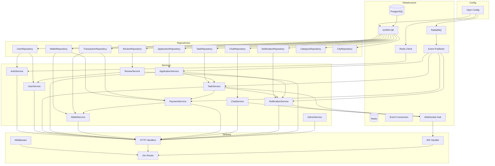

# Dependency Graph

## Composition Root (Phase 2)

`cmd/api/main.go` wires all dependencies via constructor injection:



## Service Dependency Matrix

| Service | Depends On |
|---------|------------|
| **AuthService** | UserRepository, Redis (sessions, blacklist), JWT |
| **UserService** | UserRepository, ReviewRepository |
| **TaskService** | TaskRepository, WalletRepository, PaymentService, EventPublisher, Cache |
| **ApplicationService** | ApplicationRepository, TaskRepository, UserRepository, TaskService, EventPublisher |
| **WalletService** | WalletRepository, TransactionRepository |
| **PaymentService** | WalletRepository, TransactionRepository, EventPublisher |
| **ChatService** | ChatRepository, TaskRepository, WebSocketHub |
| **NotificationService** | NotificationRepository, Cache, EventPublisher, WebSocketHub |
| **ReviewService** | ReviewRepository, TaskRepository, UserRepository, EventPublisher |
| **AdminService** | UserRepository, TaskRepository, TransactionRepository, ReviewRepository |

## Interface → Implementation Mapping (Phase 2)

| Interface | Implementation |
|-----------|----------------|
| `user/repository.Repository` | `user/infra/gorm_repository.go` |
| `task/repository.Repository` | `task/infra/gorm_repository.go` |
| `auth/service.Service` | `auth/service/service_impl.go` |
| `common/event.Publisher` | `pkg/rabbitmq/publisher.go` |
| `common/cache.Cache` | `pkg/redis/cache.go` |

## Package Import Rules

```
cmd/api          → internal/*/handler, pkg/configs
internal/*/handler → internal/*/service, internal/common
internal/*/service → internal/*/repository, internal/*/domain, internal/common
internal/*/repository → internal/*/domain (interfaces only)
internal/*/domain  → stdlib only (+ uuid)
pkg/*              → stdlib + third-party libs
```

No circular imports between bounded contexts. Cross-context calls go through service interfaces injected at startup.

## Event Flow: Task Verification → Payment

```mermaid
sequenceDiagram
    participant R as Requester
    participant API as TaskHandler
    participant TS as TaskService
    participant PS as PaymentService
    participant WS as WalletService
    participant DB as PostgreSQL
    participant MQ as RabbitMQ

    R->>API: POST /tasks/:id/verify
    API->>TS: VerifyCompletion(taskID, requesterID)
    TS->>TS: Validate transition → VERIFIED
    TS->>PS: ReleaseEscrow(taskID)
    PS->>DB: BEGIN; FOR UPDATE wallets
    PS->>WS: Transfer locked → agent
    PS->>DB: INSERT transactions; task → PAID
    PS->>DB: COMMIT
    PS->>MQ: payment.released
    TS->>MQ: task.verified
    MQ-->>API: NotificationConsumer
    API-->>R: 200 { success, data }
```
