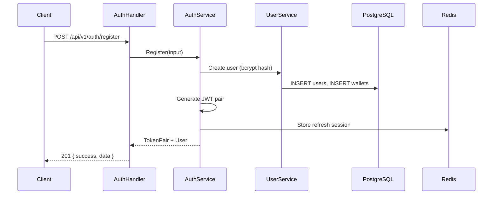
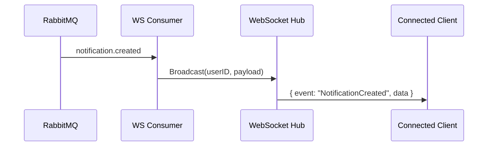
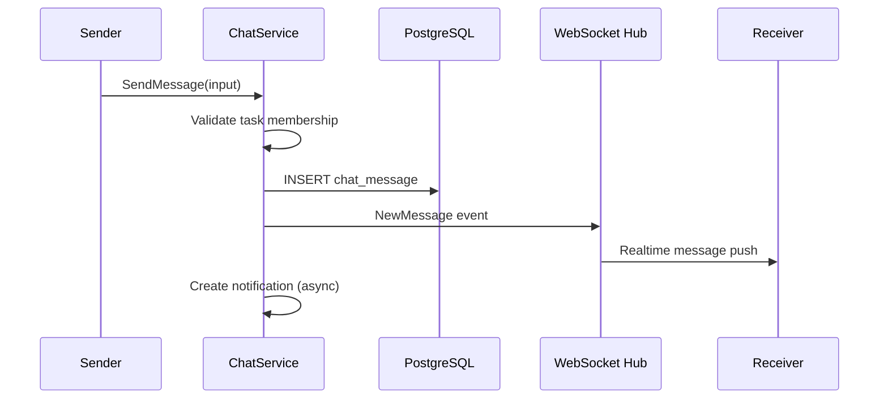

# Sequence Diagrams

## 1. User Registration & Login



## 2. Create Task with Escrow Lock

```mermaid
sequenceDiagram
    participant R as Requester
    participant H as TaskHandler
    participant TS as TaskService
    participant PS as PaymentService
    participant DB as PostgreSQL
    participant MQ as RabbitMQ

    R->>H: POST /api/v1/tasks
    H->>TS: Create(input)
    TS->>DB: BEGIN TRANSACTION
    TS->>PS: LockEscrow(budget + fee)
    PS->>DB: FOR UPDATE wallet
    PS->>DB: available -= held; locked += held
    PS->>DB: INSERT transaction (ESCROW_LOCK)
    TS->>DB: INSERT task (CREATED → OPEN)
    TS->>DB: INSERT task_timeline
    TS->>DB: COMMIT
    TS->>MQ: task.created
    TS-->>H: Task + EscrowInfo
    H-->>R: 201 { success, data }
```

## 3. Agent Application → Assignment

```mermaid
sequenceDiagram
    participant A as Agent
    participant H as ApplicationHandler
    participant AS as ApplicationService
    participant TS as TaskService
    participant NS as NotificationService
    participant WS as WebSocket

    A->>H: POST /api/v1/tasks/:id/applications
    H->>AS: Submit(input)
    AS->>AS: Validate task status = OPEN
    AS->>AS: INSERT application (PENDING)
    AS->>NS: Notify requester
    AS->>WS: NewApplication event
    AS-->>H: Application

    Note over A,WS: Requester accepts
    participant Req as Requester
    Req->>H: POST /api/v1/applications/:id/accept
    H->>AS: Accept(appID, requesterID)
    AS->>TS: Transition(OPEN → ASSIGNED)
    AS->>AS: application → ACCEPTED; others → REJECTED
    AS->>NS: Notify agent
    AS->>WS: TaskAssigned event
```

## 4. Task Completion → Verification → Payment

```mermaid
sequenceDiagram
    participant A as Agent
    participant Req as Requester
    participant TS as TaskService
    participant PS as PaymentService
    participant DB as PostgreSQL

    A->>TS: Complete(taskID)
    TS->>TS: IN_PROGRESS → COMPLETED → WAITING_FOR_VERIFICATION

    Req->>TS: Verify(taskID)
    TS->>TS: → VERIFIED
    TS->>PS: ReleaseEscrow(taskID)
    PS->>DB: BEGIN; FOR UPDATE both wallets
    PS->>DB: requester.locked -= amount
    PS->>DB: agent.available += budget
    PS->>DB: INSERT release transactions
    PS->>DB: task → PAID; COMMIT
    PS->>PS: Publish payment.released
```

## 5. Realtime Notification via WebSocket



## 6. Chat Message Flow


