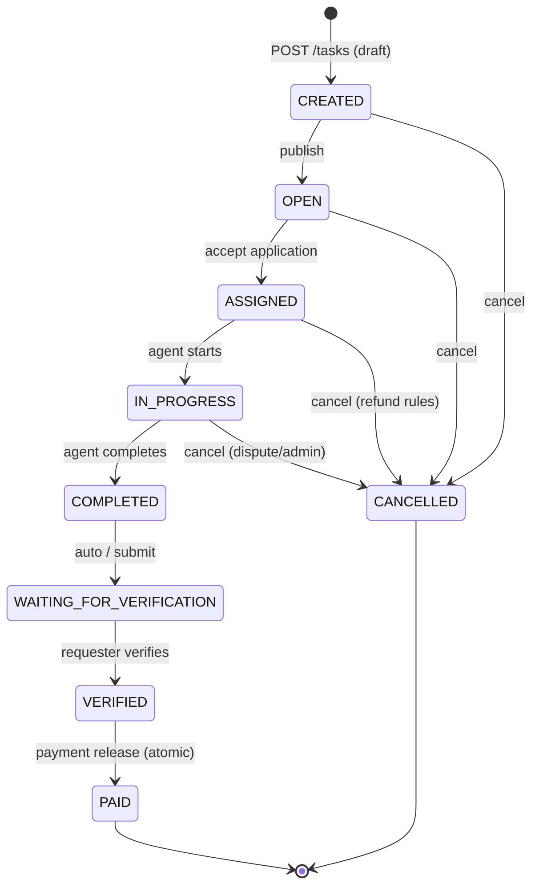

# Task State Machine

## State Diagram



## Transition Matrix

| From ↓ / To → | OPEN | ASSIGNED | IN_PROGRESS | COMPLETED | WAITING_FOR_VERIFICATION | VERIFIED | PAID | CANCELLED |
|---------------|------|----------|-------------|-----------|--------------------------|----------|------|-----------|
| CREATED | ✓ | | | | | | | ✓ |
| OPEN | | ✓ | | | | | | ✓ |
| ASSIGNED | | | ✓ | | | | | ✓ |
| IN_PROGRESS | | | | ✓ | | | | ✓ |
| COMPLETED | | | | | ✓ | | | |
| WAITING_FOR_VERIFICATION | | | | | | ✓ | | |
| VERIFIED | | | | | | | ✓ | |
| PAID | | | | | | | | |
| CANCELLED | | | | | | | | |

## Side Effects by Transition

| Transition | Domain Event | Wallet | Notification |
|------------|--------------|--------|--------------|
| → OPEN | `TaskCreated` | Lock escrow (on create) | Requester confirmation |
| → ASSIGNED | `TaskAssigned` | — | Agent + Requester |
| → IN_PROGRESS | `TaskStarted` | — | Requester |
| → COMPLETED | `TaskCompleted` | — | Requester |
| → VERIFIED | `TaskVerified` | Prepare release | — |
| → PAID | `PaymentReleased` | Release escrow | Agent payment |
| → CANCELLED | `TaskCancelled` | Refund per rules | Both parties |

## API Status Mapping

```go
CREATED                  → "posted"
OPEN                     → "awaiting_applicants"
ASSIGNED                 → "accepted"
IN_PROGRESS              → "in_progress"
COMPLETED                → "completed"
WAITING_FOR_VERIFICATION → "awaiting_verification"
VERIFIED                 → "awaiting_verification" // transient; clients rarely see
PAID                     → "paid"
CANCELLED                → "cancelled"
```

## Implementation

State validation lives in `internal/task/domain/task.go`:

```go
func (t *Task) CanTransitionTo(next TaskStatus) error
func (t *Task) TransitionTo(next TaskStatus, actorID uuid.UUID) error
```

Every transition appends a `TaskTimeline` entry for audit and frontend timeline display.
